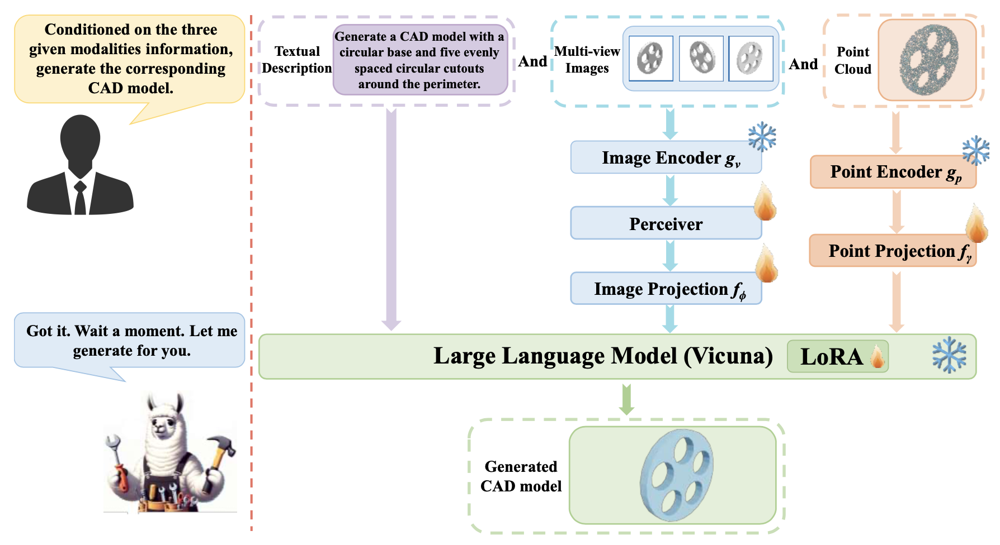
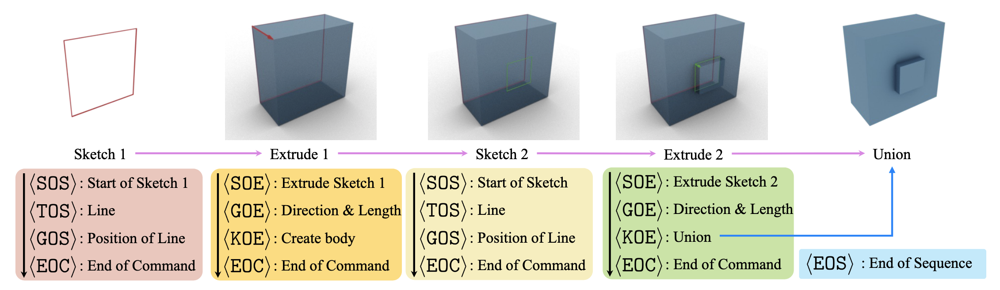

<p align="center">

<h1 align="center">CAD-MLLM: Unifying Multimodality-Conditioned CAD Generation With MLLM</h1>
  <p align="center">
    <a href="https://davidxu-jj.github.io/"><strong>Jingwei Xu<sup>1*</sup></strong></a>
    ·
    <a href="https://github.com/jeremiah-wang"><strong>Chenyu Wang<sup>2*</sup></strong></a>
    ·
    <a href="https://maikouuu.github.io/"><strong>Zibo Zhao<sup>1</sup></strong></a>
    ·
    <a href="https://scholar.google.com/citations?user=A6K6bkoAAAAJ&hl=en"><strong>Wen Liu<sup>3</sup></strong></a>
    ·
    <a href="https://scholar.google.com/citations?user=XqLiBQMAAAAJ&hl=en"><strong>Yi Ma<sup>4</sup></strong></a>
    ·
    <a href="https://scholar.google.com.sg/citations?user=fe-1v0MAAAAJ&hl=en"><strong>Shenghua Gao<sup>4†</sup></strong></a>
    <br>
    <br>
    <a href="https://arxiv.org/abs/2411.04954"></a>
    <a href="https://cad-mllm.github.io/"></a>
    <br>
    <b>ShanghaiTech University | Transcengram | DeepSeek AI | University of Hong Kong</b>
    <br>
    (* denotes equal contribution, † denotes the corresponding author)
    </p>

<table align="center">
    <tr>
    <td>
      
    </td>
    </tr>
  </table>
</p>

# 🎉 News 
- **[2025.05]** 🔥🔥🔥 Release the Evaluation Code on the proposed new metrics
- **[2025.05]** 🔥🔥🔥 Release the Omni-CAD dataset
- **[2024.11]** 📢📢📢 Release arXiv paper and init project


# To Do List
- [ ] Release the Inference Code
- [ ] Release the Training Code
- [x] Release the Evaluation Code on the proposed new metrics
- [x] Release the Omni-CAD dataset
- [x] Release Project Page & Technical Report

# Example of Command Sequence Construction



# Simple Demonstration

Please view our [project page](https://cad-mllm.github.io/) for more information.

https://github.com/user-attachments/assets/c5cd9fe9-433e-4733-86ce-d0ebb62d695d

# Data

Our preprocessing code is built upon [DeepCAD](https://github.com/ChrisWu1997/DeepCAD).

## Step 0: Environment setup

```
git submodule update --init --recursive
conda create -n DeepCAD python=3.8
cd ./3rd_party/DeepCAD
pip install -r requirements.txt
conda install -c conda-forge pythonocc-core=7.8.1
```

## Step 1: Download the dataset

(model json description and the text caption)

```
mkdir data
cd ./data
wget https://huggingface.co/datasets/jingwei-xu-00/Omni-CAD/resolve/main/Omni-CAD.zip
unzip Omni-CAD.zip
cd ..
```

The directory structure should look like this:

```
└── data
    └── Omni-CAD
        └── json
            ├── 0000
            ├── 0001
            └── ...
        └── txt
            ├── 0000.json
            ├── 0001.json
            └── ...
```

## Step 2: Export the mesh

```
cd ./3rd_party/DeepCAD/utils 
python3 ./export2step.py --src ../../../data/Omni-CAD/json --form json --num -1 [--output_form ply]
cd ../../..
```

After the `.step` file export is complete, run:

```
cd ./data/Omni-CAD
mv json_step step
# [mv json_ply ply]
cd ../..
```

The directory should look like:

```
└── data
    └── Omni-CAD
        └── json
            ├── 0000
            ├── 0001
            └── ...
        └── step
            ├── 0000
            ├── 0001
            └── ...
        └── txt
            ├── 0000.json
            ├── 0001.json
            └── ...
```

## Step 3: Point cloud sampling

```
cd ./3rd_party/DeepCAD/utils
python3 export2pc.py --data_root ../../../data/Omni-CAD --normalize --output_format npy 
cd ../../..
```

The directory structure should look like this:

```
└── data
    └── Omni-CAD
        ├── json
        ├── step / (ply)
        ├── txt
        └── pcd
```

## Step 4: Image rendering

There are multiple options for the image rendering with the models.

1. [**Blender**](https://www.blender.org/)
2. [**Mitsuba3**](https://www.mitsuba-renderer.org/)
3. [**Open3D**](http://www.open3d.org/)
4. [**PythonOCC**](https://github.com/tpaviot/pythonocc-core)
5. ...

Here we provide a script to utilize the [**PythonOCC**](https://github.com/tpaviot/pythonocc-core) to render the `.step` file.

```
cd ./scripts
python3 occ_render.py --src ../data/Omni-CAD/step --num -1
cd ..
```

You may use `.ply` file format to render the image with other renderers for simplicity.

```
cd ./data/Omni-CAD
mv step_img img
cd ../..
```

Finally, the directory structure should look like this:

```
└── data
    └── Omni-CAD
        ├── json
        ├── step / (ply)
        ├── txt
        ├── pcd
        └── img
```

# Model code

We state our plan at https://github.com/CAD-MLLM/CAD-MLLM/issues/1.

# Metrics computation code

In this paper, we proposed new metrics **Segment Error (SegE), Dangling Edge Length (DangEL), Self Intersection Ratio (SIR), and Flux Enclosure Error (FluxEE)**.

If you want to evaluate them in your own project, please visit [CAD-MLLM-metrics](https://github.com/DavidXu-JJ/CAD-MLLM-metrics) for the code and guidance.

# Acknowledgements

We acknowledge the support of the following projects to our data preprocessing: [DeepCAD](https://github.com/ChrisWu1997/DeepCAD).

# Bibtex

```bibtex
@misc{xu2024CADMLLM,
      title={CAD-MLLM: Unifying Multimodality-Conditioned CAD Generation With MLLM}, 
      author={Jingwei Xu and Zibo Zhao and Chenyu Wang and Wen Liu and Yi Ma and Shenghua Gao},
      year={2024},
      eprint={2411.04954},
      archivePrefix={arXiv},
      primaryClass={cs.CV}
}
```
